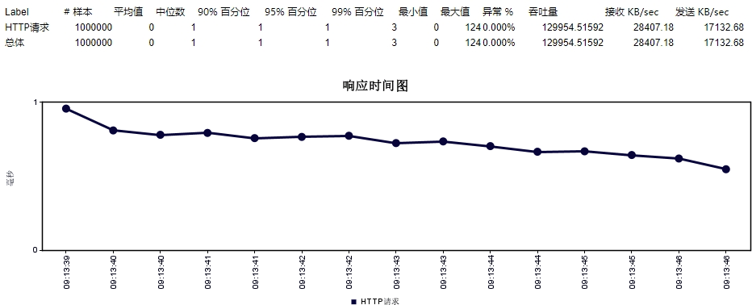
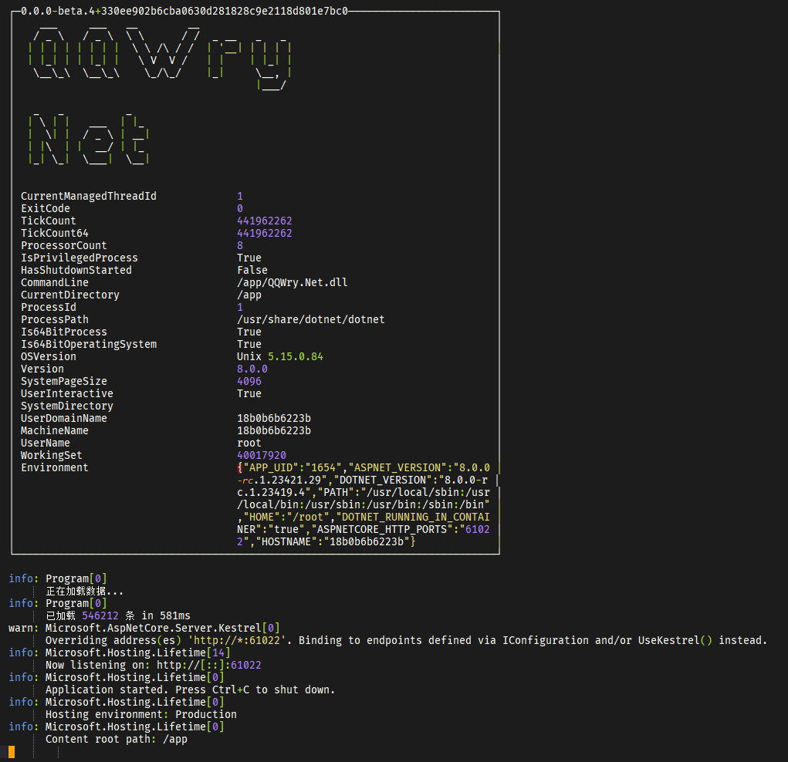

# QQWry.NET
基于纯真IP数据库的高性能（亚毫秒级响应时间、10w+QPS 吞吐量）IP归属地查询 WebApi 服务

## 数据来源日期
纯真网络 2023年09月20日IP数据

## 性能评测
|项目|说明|
|-|-|
硬件环境|i7-12700/32g
软件环境|win10/.net8.0rc1
测试方式|JMeter->WebApi
测试参数|100 线程 x 10000 个随机 IP（0.0.0.0-255.255.255.255）
吞吐量|129,954 qps
平均响应时间|<1ms



## 开始使用
- docker 方式
  - ```docker run -p 61022:61022 nsnail2/qqwry.net```
- 二进制文件方式
    - 下载地址
      - [Release](https://github.com/nsnail/QQWry.Net/releases)
    - Windows
      - ```./QQWry.Net.exe```
    - Linux
      - ```sudo chmod +x ./QQWry.Net```
      - ```./QQWry.Net```
- 源码编译方式
    1. [下载安装 dotnet8-sdk](https://dotnet.microsoft.com/zh-cn/download/dotnet/8.0)
    2. ```git clone https://github.com/nsnail/QQWry.Net.git```
    3. ```dotnet run --project ./QQWry.Net/src/QQWry.Net/QQWry.Net.csproj```
- 运行截图
    - 